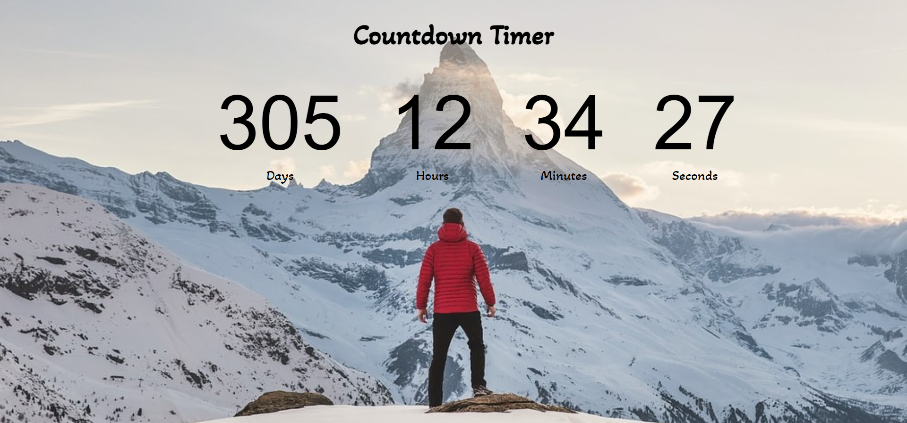

# Countdown Timer

Beginner Countdown Project with HTML, CSS & JavaScript.

## Project goals

This project shows how to:

- use HTML and CSS for intuitive UI design
- write javascript functions
- update UI elements using javascript
- build a robust frontend-backend flow

_Note: The countdown will finish on 1st January, 2022. To change the ending time of the countdown change time [here](./app.js)_

## Preview

