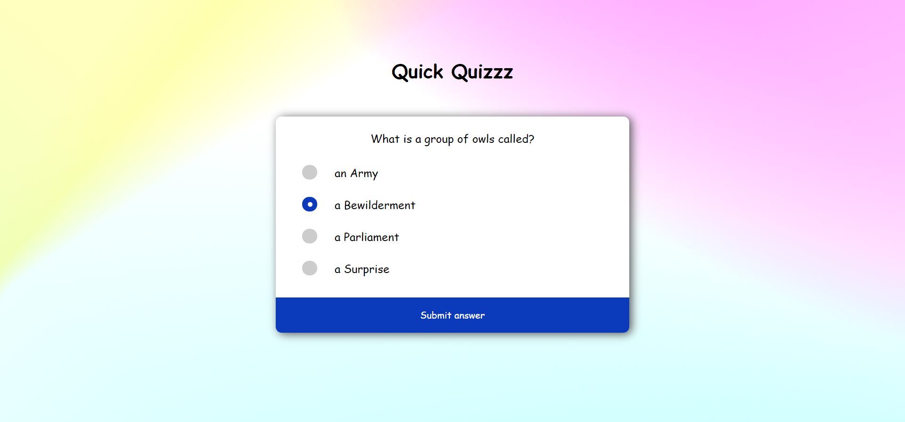

# Quick Quizzz

Beginner Quiz Project with HTML, CSS & JavaScript.

## Project goals

This project shows how to:

- use HTML and CSS to build custom UI elements
- write list of quiz objects
- write javascript functions to change questions and get answers
- build a robust frontend-backend flow
- create and update UI elements using javascript

## Preview

