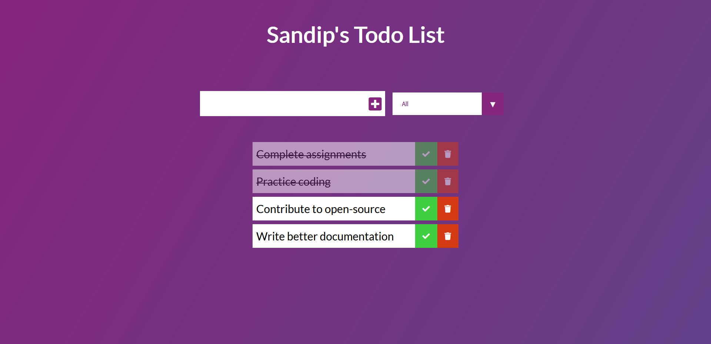

# Todo List

Beginner Todo List Project with HTML, CSS & JavaScript.

## Project goals

This project shows how to:

- use HTML and CSS for better UI and UX and also simple animations
- write javascript functions
- build a robust frontend-backend flow
- create and update UI elements using javascript
- use local storage to save, retrieve and delete todos

## Todos

- [ ] Implement save and retrieve `Checked` todo list from local storage 

## Preview

## Delete animation

